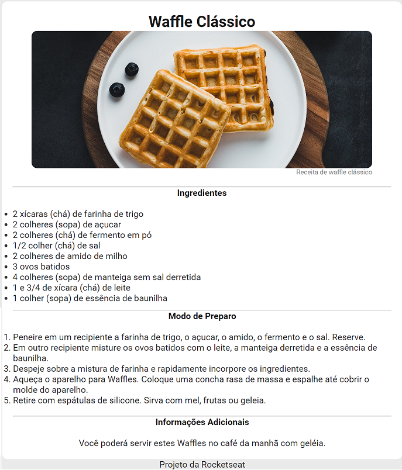

# RocketSeat - Discover - Desafios - Página de Receita
Desafio Piloto: Página de Receita do programa Discover da RocketSeat.

## Resultado

## Referências
RocketSeat - Discover - Desafio Piloto - Página de Receita: 
https://efficient-sloth-d85.notion.site/Desafio-Piloto-P-gina-de-Receita-15acc6a34f744484a2e64a1f115bfbae 
, acessado em 07/10/2023.

RocketSeat - Discover - Desafio Piloto - Página de Receita - 1 - Criando a estrutura HTML:
https://efficient-sloth-d85.notion.site/1-Criando-a-estrutura-HTML-a73054c07efa45cc9e7449c6ebf5e046
, acessado em 07/10/2023.

RocketSeat - Discover - Desafio Piloto - Página de Receita - 2 - Adicionando os estilos com CSS:
https://efficient-sloth-d85.notion.site/2-Adicionando-os-estilos-com-CSS-f0797e51911e453eabdc99634a0356a0
, acessado em 07/10/2023.

Unsplash - Imagem - Waffles:
https://unsplash.com/pt-br/fotografias/dEUyLofZe5o
, acessado em 07/10/2023.